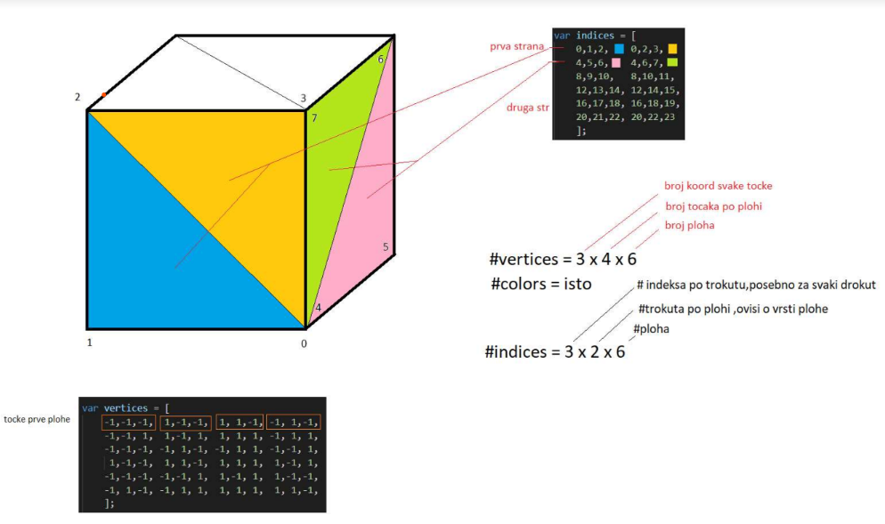

    
# OpenGL - Notes

- [OpenGL - Notes](#opengl---notes)
  - [VS tips](#vs-tips)
  - [GLFW](#glfw)
  - [Graphics pipeline](#graphics-pipeline)
  - [Vertex shader code](#vertex-shader-code)
  - [Vertex shader code compilation check](#vertex-shader-code-compilation-check)
  - [Fragment shader code](#fragment-shader-code)
  - [Creating shader program (FINAL RENDERING OBJECT)](#creating-shader-program-final-rendering-object)
  - [Check for compilation success](#check-for-compilation-success)
  - [Drawing an object in OpenGL](#drawing-an-object-in-opengl)
  - [Vertex Array Object](#vertex-array-object)


## VS tips
project name and go to Properties page, please expand 
```
Configuration Properties -> Linker -> System
```
please select Console (/SUBSYSTEM:CONSOLE) in SubSystem dropdown


```
linker > additional lib directories: 
$(SolutionDir)\External\SFML\lib;%(AdditionalLibraryDirectories)
```
```
c++ > additional include dirs: 
$(SolutionDir)\ExternaMFML\include;%(AdditionallncludeDirectories)
```

```
linker > input:
sfml-graphics-d.lib 
sfml-audio-d.lib 
sfml-network-d.lib 
sfml-window-d.lib 
sfml-system-d.lib

sfml-graphics-d.lib;sfml-audio-d.lib;sfml-network-d.lib;sfml-window-d.lib;sfml-system-d.lib;% 
(AdditionalDependencies)
```

## GLFW 

GLFW providing the bare necessities required for rendering goodies to the screen
allows us to create an OpenGL context
define window parameters and handle user input
GLAD
location of most of its functions is not known at compile-time and needs to be queried at run-time 
It is then the task of the developer to retrieve the location of the functions he/she needs and store 
them in function pointers for later use

Hello Window

```cpp
#include <glad/glad.h> 
#include <GLFW/glfw3.h>

int main()
{
    glfwlnit();
    glfwWindowHint(GLFW_CONTEXT_VERSION_MAJOR, 3); 
    glfwWindowHint(GLFW_CONTEXT_VERSION_MINOR, 3); 
    glfwWindowHint(GLFW_OPENGL_PROFILE, GLFW_OPENGL_CORE_PROFILE); 
    //glfwWindowHint(GLFW_OPENGL_FORWARD_COMPAT, GL_TRUE);

    return 0;
}
```

Next we're required to create a window object. This window object holds all the windowing data and is 
used quite frequently by GLFW's other functions.


```cpp
GLFWwindow* window = glfwCreateWindow(800, 600, "LearnOpenGL", NULL, NULL);
if (window == NULL)
{
    std::cout << "Failed to create GLFW window" << std::endl;
    glfwTerminate();
    return -1;
}
glfwMakeContextCurrent(window);
```

we mentioned that GLAD manages function pointers for OpenGL so we want to initialize GLAD before 
we call any OpenGL function


```cpp
if (!gladLoadGLLoader((GLADloadproc)glfwGetProcAddress))
{std::cout << "Failed to initialize GLAD" << std::endl; 
    return -1;
}
glViewport(0, 0, 800, 600);

void framebuffer_size_callback(GLFWwindow* window, int width, int height);
void framebuffer_size_callback(GLFWwindow* window, int width, int height)
{
    glViewport(0, 0, width, height);
}
```

We do have to tell GLFW we want to call this function on every window resize by registering it: 

```cpp
glfwSetFramebufferSizeCallback(window, framebuffer_size_callback); 

while(!glfwWindowShouldClose(window))
{processInput(window);

    glClearColor(0.2f, 0.3f, 0.3f, 1.0f); //state setting function 
    glClear(GL_COLOR_BUFFER_BIT); //state using function

    glfwSwapBuffers(window); 
    glfwPollEvents();
}
void processlnput(GLFWwindow *window)
{if(glfwGetKey(window, GLFW_KEY_ESCAPE) == GLFW_PRESS)
    glfwSetWindowShouldClose(window, true);
}

glfwTerminate(); 
return 0;
```

## Graphics pipeline
1. transforms your 3D coordinates into 2D coordinates
2. transforms the 2D coordinates into actual colored pixels




set of 3D coords -> graphics pipeline -> colored 2D pixels

graphics pipeline is divided into shaders

shaders work in parallel

vertex is some collection of data per 3D coordinate

fragment in OpenGL is all the data required for OpenGL to render a single pixel


Input for graphics pipeline
1. ```Vertex Data[]``` (set of verticies)
2. another input: hint (primitive) for what kind of render types you want to form with the data (are these 
verticies,or triangles?)

eg: GL_POINTS , GL_TRIANGLES


        include (GLAD,GLFW)
        main (init GLFW window)
        create win object (holds all win data)
        init GLAD (manages fn.pointers)
        set viewport (def.size of render win)
        registering callback fn. (to call viewport on every resize) 
        while loop (swap buffers,poll events )
        cleanup (glfwTerminate)


1. vertex shader (first shader in GP) 

    input: a single vertex

    use: to transform 3D coordinates into different 3D coordinates, 
    allows us to do some basic processing on the vertex attributes


2. primitive assembly (second shader in GP)

    input: all the vertices (or vertex if GL POINTS is chosen)

    use: assembles all the point(s) in the primitive shape given; in this case a triangle


3. geometry shader (3. shader in GP)

    input: collection of vertices that form a primitive

    use: to generate other shapes by emitting new vertices to form new (or other) primitive(s). In this 
    example case, it generates a second triangle out of the given shape.


4. rasterization stage (4. shader in GP)

    input: collection of vertices that form a primitive

    use: maps the resulting primitive(s) to the corresponding pixels on the final screen,resulting in fragments 
    for the fragment shader to use

    CLIPPING discards all fragments that are outside your view, increasing performance

5. fragment shader (5. shader in GP)

    input: collection of vertices that form a primitive

    use: to calculate the final color of a pixel and this is usually the stage where all the advanced OpenGL 
    effects occur,fragment shader contains data about the 3D scene that it can use to calculate the final 
    pixel color (like lights, shadows, color of the light and so on)

6. alpha test and blending (6. shader in GP)

    input: collection of vertices that form a primitive

    use: checks the corresponding depth (and stencil) value of the fragment and uses those to check if the 
    resulting fragment is in front or behind other objects and should be discarded accordingly. The stage 
    also checks for alpha values (alpha values define the opacity of an object) and blends the objects 
    accordingly. So even if a pixel output color is calculated in the fragment shader, the final pixel color 
    could still be something entirely different when rendering multiple triangles


-for almost all the cases we only have to work with the vertex and fragment shader

-geometry shader is optional

- we are required to define at least a vertex and fragment shader of our own

COORDINATES
z - depth
x,y - (0,0) is in center


```cpp
//creating VBO (using them to transfer data to GPU)
unsigned int VBO; // a buffer object
glGenBuffers(1, &VBO);
glBindBuffer(GL_ARRAY_BUFFER, VBO); //binding to a buffer


//from now on , any buffer calll we make on GL_ARRAY_BUFFER will only modify that buffer

glBufferData(GL_ARRAY_BUFFER, sizeof(vertices), vertices, GL_STATIC_DRAW); // to copy user-defined 
```

data into the currently bound buffer
arguments:

```type of the buffer we want to copy data into```: the vertex buffer object currently bound to the GL_ARRAY_BUFFER target
size of the data (in bytes) we want to pass to the buffer
the actual data we want to send
specifies how we want the graphics card to manage the given data

```GL_STATIC_DRAW```: the data will most likely not change at all or very rarely. 

```GL_DYNAMIC_DRAW```: the data is likely to change a lot

```GL_STREAM_DRAW```: the data will change every time it is drawn.


## Vertex shader code

```cpp
#version 330 core
layout (location = 0) in vec3 aPos;

void main()
{gl_Position = vec4(aPos.x, aPos.y, aPos.z, 1.0);
}
```

Compiling:
it has to dynamically compile it at run-time from its source code 
we need to create a shader object


```cpp
unsigned int vertexShader;
vertexShader = glCreateShader(GL_VERTEX_SHADER);

//we attach the shader source code to the shader object and compile the shader

glShaderSource(vertexShader, 1, &vertexShaderSource, NULL); 
glCompileShader(vertexShader);
```


## Vertex shader code compilation check

```cpp
int success;
char infoLog[512];
glGetShaderiv(vertexShader, GL_COMPILE_STATUS, &success); 
if(!success)
{glGetShaderinfoLog(vertexShader, 512, NULL, infoLog);
    std::cout << "ERROR::SHADER::VERTEX::COMPILATION_FAILED\n" « infoLog « std::endl;
}
```

## Fragment shader code
used for calculating the color output of your pixels 
this eg: shader will always output an orange-ish color

```cpp
#version 330 core
out vec4 FragColor;
void main()
{FragColor = vec4(1.0f, 0.5f, 0.2f, 1.0f);
}
```

Compiling: same as vertex shader

```cpp
unsigned int fragmentShader;
fragmentShader = glCreateShader(GL_FRAGMENT_SHADER); 
glShaderSource(fragmentShader, 1, &fragmentShaderSource, NULL); 
glCompileShader(fragmentShader);
```

## Creating shader program (FINAL RENDERING OBJECT)

the final linked version of multiple shaders combined
To use the recently compiled shaders we have to link them to a shader program object and then activate 
this shader program when rendering objects.

```cpp
unsigned int shaderProgram; 
shaderProgram = glCreateProgram();

glAttachShader(shaderProgram, vertexShader); 
glAttachShader(shaderProgram, fragmentShader); 
glLinkProgram(shaderProgram);
```

## Check for compilation success

```cpp
glGetProgramiv(shaderProgram, GL_LINK_STATUS, &success); 
if(!success) {
    glGetProgramInfoLog(shaderProgram, 512, NULL, infoLog);

}
```

result is a program object that we can activate by calling glUseProgram 
glUseProgram(shaderProgram);
glDeleteShader(vertexShader); //dont need it anymore
glDeleteShader(fragmentShader); //dont need it anymore


Linking Vertex Attributes
(we specified how OpenGL should interpret the vertex data)

```cpp
glVertexAttribPointer(0, 3, GL_FLOAT, GL_FALSE, 3 * sizeof(float), (void*)0); 
glEnableVertexAttribArray(0);
```

first parameter specifies which vertex attribute we want to configure. Remember that we specified the 
location of the position vertex attribute in the vertex shader with layout (location = 0). This sets the 
location of the vertex attribute to 0 and since we want to pass data to this vertex attribute, we pass in 
0.

vertex attribute is a vec3 so it is composed of 3 values

third argument specifies the type of the data which is GL_FLOAT 

next argument specifies if we want the data to be normalized

stride and tells us the space between consecutive vertex attributes
we could've also specified the stride as 0 to let OpenGL determine the stride (this only works when 
values are tightly packed)

The last parameter is of type void* and thus requires that weird cast. This is the offset of where the
position data begins in the buffer. Since the position data is at the start of the data array this value is just 
0


Each vertex attribute takes its data from memory managed by a VBO and which VBO it takes its data 
from (you can have multiple VBOs) is determined by the VBO currently bound to GL_ARRAY_BUFFER 
when calling glVertexAttribPointer. Since the previously defined VBO is still bound before calling 
glVertexAttribPointer vertex attribute 0 is now associated with its vertex data.


## Drawing an object in OpenGL


```cpp
// 0. copy our vertices array in a buffer for OpenGL to use
glBindBuffer(GL_ARRAY_BUFFER, VBO);
glBufferData(GL_ARRAY_BUFFER, sizeof(vertices), vertices, GL_STATIC_DRAW);
// 1. then set the vertex attributes pointers
glVertexAttribPointer(0, 3, GL_FLOAT, GL_FALSE, 3 * sizeof(float), (void*)0); 
glEnableVertexAttribArray(0);
// 2. use our shader program when we want to render an object
glUseProgram(shaderProgram);
// 3. now draw the object
someOpenGLFunctionThatDrawsOurTriangle();
```


## Vertex Array Object
VAO can be bound just like a vertex buffer object and any subsequent vertex attribute calls from that 
point on will be stored inside the VAO. This has the advantage that when configuring vertex attribute 
pointers you only have to make those calls once and whenever we want to draw the object, we can just
bind the corresponding VAO. This makes switching between different vertex data and attribute 
configurations as easy as binding a different VAO. All the state we just set is stored inside the VAO.


